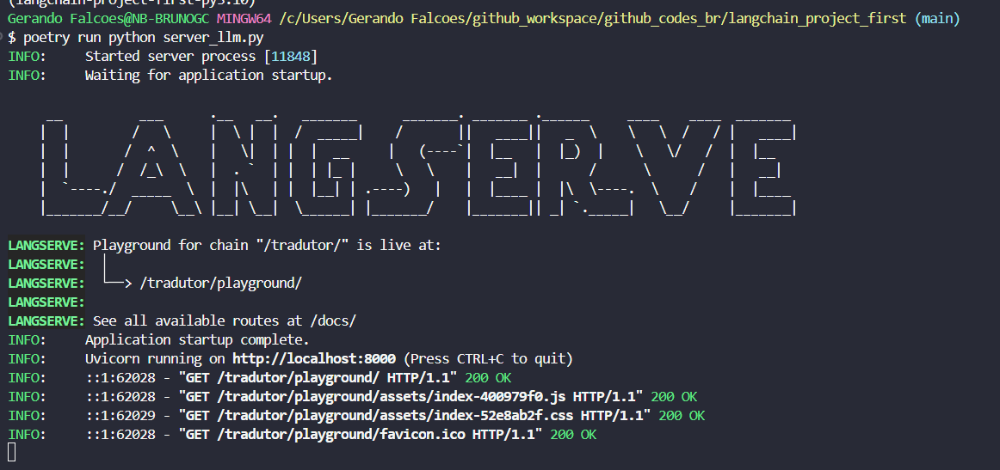
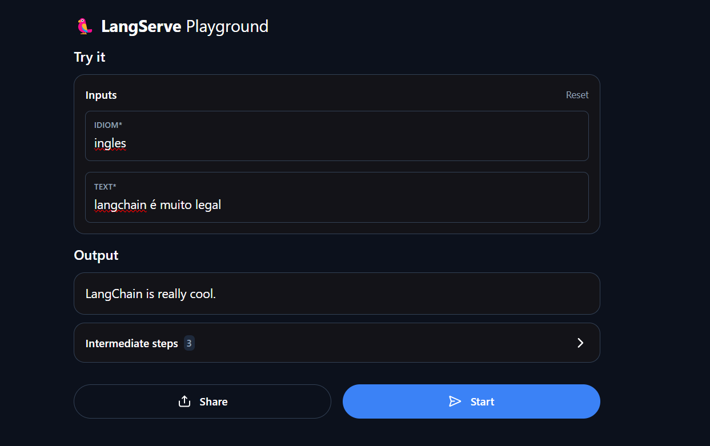

# #Langchain com OpenAI - Tradução de Frases

o projeto tem por objetivo apresentar a minha evolução em desenvolvimentos de modelos de LLM.

### Organização do projeto
```
├──── .git
├──── docs/
├──── src/
├──── .env
├──── .gitignore
├──── poetry.lock
├──── pyproject.toml
├──── requirements.txt
└── README.md
```

### Instrução para execução do projeto

1. Clone do projeto em sua máquina
```
> git clone https://github.com/imbrunoagc/langchainOpenAI-1.git
```

2. Instalação do poetry caso não tenha em sua máquina
```
> pip install poetry
```

3. Ativação do ambiente
```
> Poetry shell
```

4. Crie um .env na raiz do projeto
```
### Adicione a sua chave OPENAI_API_KEY
> OPENAI_API_KEY = 'chave-api-aqui'
```

5. Execução do projeto principal
```
> Poetry run python src/server_llm.py
```
<table>
    <td>
    </img></td></tr>
</table>

6. Acesso ao link disponibilizado
```
> http://localhost:8000/tradutor/playground/
```

7. Se divirta e interaja com a interface
<table>
    <td>
    </img></td></tr>
</table>


### Fonte:
https://python.langchain.com/docs/introduction/